# Anthropic Tool Calling Architecture in test.py

## Overview

This document explains how Anthropic's Claude API uses **tool calling** (function calling) to enable the AI to interact with external systems and execute code. The `test.py` script demonstrates a practical implementation where Claude can analyze files by calling custom Python functions.

---

## 🎯 What is Tool Calling?

**Tool calling** allows Claude to:
1. **Recognize** when it needs external functionality to answer a question
2. **Request** specific tools/functions with precise arguments
3. **Receive** results from those tools
4. **Synthesize** a final answer using the tool outputs

Think of it as giving Claude a "toolbox" of functions it can use to solve problems.

---

## 📊 High-Level Architecture

```mermaid
graph TB
    User[👤 User] -->|"Question: How many complaints from Israel?"| API[🔧 FileAnalyzer]
    API -->|"System Prompt + Tools Definition"| Claude[🤖 Claude API]
    Claude -->|"Tool Request: search_text"| API
    API -->|"Execute search_text()"| Tools[⚙️ Tool Executor]
    Tools -->|"Result: 14 matches"| API
    API -->|"Tool Result"| Claude
    Claude -->|"Final Answer"| User

    style Claude fill:#FF6B6B
    style Tools fill:#4ECDC4
    style API fill:#95E1D3
    style User fill:#F38181
```



---

## 🔄 Complete Tool Calling Flow

### Step-by-Step Sequence


---

## 🛠️ Tool Definitions in test.py

### Tools Available to Claude

The script defines **4 main tools**:

```mermaid
graph LR
    Claude[🤖 Claude] --> T1[📄 view_file]
    Claude --> T2[🔍 search_text]
    Claude --> T3[⚙️ run_command]
    Claude --> T4[📊 analyze_data]

    T1 --> |"Read file content"| Files[(📁 Files)]
    T2 --> |"Pattern matching"| Files
    T3 --> |"Shell commands"| System[💻 System]
    T4 --> |"Statistics"| Data[📈 Data]

    style Claude fill:#FF6B6B
    style T1 fill:#A8E6CF
    style T2 fill:#FFD3B6
    style T3 fill:#FFAAA5
    style T4 fill:#FF8B94
```



### 1. view_file

**Purpose**: Read and display file contents

```json
{
  "name": "view_file",
  "description": "Read and view the contents of an uploaded file",
  "input_schema": {
    "type": "object",
    "properties": {
      "filename": {
        "type": "string",
        "description": "Name of the file to view"
      },
      "line_range": {
        "type": "array",
        "items": {"type": "integer"},
        "description": "Optional line range [start, end]"
      }
    },
    "required": ["filename"]
  }
}
```

**Example Call**:
```python
# Claude requests:
{
  "name": "view_file",
  "input": {
    "filename": "test.txt",
    "line_range": [1, 50]
  }
}

# Returns:
{
  "content": "1    Line 1 content\n2    Line 2 content...",
  "total_lines": 5973,
  "file_size": 213530
}
```

### 2. search_text

**Purpose**: Search for patterns using regex

```json
{
  "name": "search_text",
  "description": "Search for text patterns using grep-like functionality",
  "input_schema": {
    "type": "object",
    "properties": {
      "filename": {"type": "string"},
      "pattern": {"type": "string", "description": "Regex pattern"},
      "case_sensitive": {"type": "boolean", "default": false},
      "count_only": {"type": "boolean", "default": false}
    },
    "required": ["filename", "pattern"]
  }
}
```

**Example Call**:
```python
# Claude requests:
{
  "name": "search_text",
  "input": {
    "filename": "test.txt",
    "pattern": "Israel",
    "case_sensitive": false,
    "count_only": true
  }
}

# Returns:
{
  "count": 14,
  "matches": ["000201357115 Israel PT3Y...", "..."]
}
```

### 3. run_command

**Purpose**: Execute shell commands for advanced analysis

```json
{
  "name": "run_command",
  "description": "Execute shell commands for advanced file analysis",
  "input_schema": {
    "type": "object",
    "properties": {
      "command": {"type": "string"},
      "filename": {"type": "string"}
    },
    "required": ["command"]
  }
}
```

**Example Call**:
```python
# Claude requests:
{
  "name": "run_command",
  "input": {
    "command": "grep -i 'south korea' test.txt | wc -l"
  }
}

# Returns:
{
  "stdout": "54",
  "stderr": "",
  "return_code": 0
}
```

### 4. analyze_data

**Purpose**: Statistical analysis on data

```json
{
  "name": "analyze_data",
  "description": "Perform statistical analysis on found data patterns",
  "input_schema": {
    "type": "object",
    "properties": {
      "data_type": {
        "type": "string",
        "enum": ["count", "frequency", "summary"]
      },
      "data": {"type": "array", "items": {"type": "string"}}
    },
    "required": ["data_type", "data"]
  }
}
```

---

## 💻 Code Implementation

### Tool Execution Loop

```python
# From test.py - simplified
def ask_question(self, question: str) -> str:
    # 1. Create initial message
    messages = [{
        "role": "user",
        "content": question
    }]

    # 2. Make API call with tools
    response = self.client.messages.create(
        model="claude-sonnet-4-20250514",
        max_tokens=4000,
        system=system_message,
        messages=messages,
        tools=self.define_tools(),  # ← Tools definition
        tool_choice={"type": "auto"}  # ← Let Claude decide
    )

    # 3. Loop while Claude requests tools
    current_messages = messages.copy()

    while response.stop_reason == "tool_use":
        # Process each tool call
        tool_results = []
        for content_block in response.content:
            if content_block.type == "tool_use":
                # Execute the tool
                result = self.execute_tool(
                    content_block.name,      # Tool name
                    content_block.input      # Tool arguments
                )

                # Save result
                tool_results.append({
                    "tool_use_id": content_block.id,
                    "content": json.dumps(result)
                })

        # 4. Add assistant response + tool results to conversation
        current_messages.append({
            "role": "assistant",
            "content": response.content
        })

        current_messages.append({
            "role": "user",
            "content": tool_results
        })

        # 5. Continue conversation
        response = self.client.messages.create(
            model="claude-sonnet-4-20250514",
            max_tokens=4000,
            messages=current_messages,
            tools=self.define_tools()
        )

    # 6. Extract final text answer
    return response.content[0].text
```

---

## 🎬 Real Example: Multi-Step Query

**User Question**: "How many complaints are from Israel?"

```mermaid
flowchart TD
    Q[🤔 Question: How many from Israel?]
    Q --> A1[Step 1: Claude analyzes question]
    A1 --> D1{Needs file info?}
    D1 -->|Yes| T1[🔧 Tool Call: view_file]
    T1 --> R1[📄 Returns: File structure, 5973 lines]

    R1 --> A2[Step 2: Claude sees it's structured data]
    A2 --> T2[🔧 Tool Call: search_text pattern='Israel']
    T2 --> R2[📊 Returns: 14 matches with line numbers]

    R2 --> A3[Step 3: Claude verifies count]
    A3 --> T3[🔧 Tool Call: run_command grep -c]
    T3 --> R3[✅ Returns: stdout='14']

    R3 --> Final[🎯 Final Answer: There are 14 complaints from Israel]

    style Q fill:#FFE66D
    style T1 fill:#A8E6CF
    style T2 fill:#FFD3B6
    style T3 fill:#FFAAA5
    style Final fill:#4ECDC4
```



**Actual API Conversation**:

```python
# Message 1: User
{
  "role": "user",
  "content": "How many complaints are from Israel?"
}

# Response 1: Claude requests tool
{
  "role": "assistant",
  "content": [
    {"type": "text", "text": "I'll search the file for Israel mentions."},
    {"type": "tool_use", "id": "toolu_123", "name": "search_text",
     "input": {"filename": "test.txt", "pattern": "Israel", "count_only": true}}
  ],
  "stop_reason": "tool_use"
}

# Message 2: Tool result
{
  "role": "user",
  "content": [
    {"type": "tool_result", "tool_use_id": "toolu_123",
     "content": "{\"count\": 14, \"matches\": [...]}""}
  ]
}

# Response 2: Claude may verify
{
  "role": "assistant",
  "content": [
    {"type": "text", "text": "Let me verify with grep..."},
    {"type": "tool_use", "id": "toolu_456", "name": "run_command",
     "input": {"command": "grep -i israel test.txt | wc -l"}}
  ],
  "stop_reason": "tool_use"
}

# Message 3: Tool result
{
  "role": "user",
  "content": [
    {"type": "tool_result", "tool_use_id": "toolu_456",
     "content": "{\"stdout\": \"14\", \"return_code\": 0}"}
  ]
}

# Final Response: Answer
{
  "role": "assistant",
  "content": [
    {"type": "text", "text": "There are 14 complaints from Israel in the document."}
  ],
  "stop_reason": "end_turn"
}
```

---

## 🔑 Key Concepts

### 1. Tool Choice Modes

```python
# Auto - Claude decides whether to use tools
tool_choice={"type": "auto"}

# Required - Force Claude to use at least one tool
tool_choice={"type": "any"}

# Specific - Force a specific tool
tool_choice={"type": "tool", "name": "search_text"}
```

### 2. Stop Reasons

| Stop Reason | Meaning |
|-------------|---------|
| `tool_use` | Claude wants to call a tool - continue loop |
| `end_turn` | Claude is done - has final answer |
| `max_tokens` | Reached token limit |
| `stop_sequence` | Hit a stop sequence |

### 3. Message Types


---

## 🎯 Best Practices

### 1. Clear Tool Descriptions

✅ **Good**:
```python
{
  "name": "search_text",
  "description": "Search for text patterns in files using regex. Returns matching lines with line numbers and context."
}
```

❌ **Bad**:
```python
{
  "name": "search",
  "description": "Searches stuff"
}
```

### 2. Validate Tool Input

```python
def execute_tool(self, tool_name: str, tool_input: dict) -> dict:
    try:
        # Validate required fields
        if tool_name == "search_text":
            if "filename" not in tool_input:
                return {"error": "filename is required"}
            if "pattern" not in tool_input:
                return {"error": "pattern is required"}

        # Execute tool
        return self._search_text(tool_input)
    except Exception as e:
        return {"error": str(e)}
```

### 3. Return Structured Results

✅ **Good** - Structured JSON:
```python
return {
    "count": 14,
    "matches": [...],
    "total_lines": 5973
}
```

❌ **Bad** - Plain text:
```python
return "Found 14 matches"
```

---

## 🚀 Running the System

### Basic Usage

```bash
# Ask a question
python test.py --question "How many complaints from Israel?"

# Interactive mode
python test.py --interactive

# With custom file
python test.py --file my_data.txt --question "Count users"
```

### System Requirements

```bash
pip install anthropic>=0.34.0
```

### Environment Setup

```bash
# Set API key
export ANTHROPIC_API_KEY="sk-ant-api03-..."

# Or use .env file
echo "ANTHROPIC_API_KEY=sk-ant-api03-..." > .env
```

---

## 📈 Performance Characteristics

| Aspect | Details |
|--------|---------|
| **Latency** | ~2-5 seconds per tool call |
| **Token Cost** | Tools count as input tokens |
| **Max Tools** | ~20 tools recommended |
| **Iterations** | Usually 1-3 tool calls per query |
| **Accuracy** | High with clear descriptions |

---

## 🔍 Debugging Tips

### 1. Enable Verbose Logging

```python
# Log all tool calls
for content_block in response.content:
    if content_block.type == "tool_use":
        print(f"Tool: {content_block.name}")
        print(f"Input: {content_block.input}")
```

### 2. Check Stop Reason

```python
print(f"Stop reason: {response.stop_reason}")
if response.stop_reason == "tool_use":
    print("Claude needs more tools")
elif response.stop_reason == "end_turn":
    print("Claude has final answer")
```

### 3. Validate Tool Results

```python
tool_result = self.execute_tool(name, input)
if "error" in tool_result:
    print(f"Tool error: {tool_result['error']}")
```

---

## 📚 Summary

**Anthropic Tool Calling** enables Claude to:
- 🔧 Use custom functions dynamically
- 🔄 Make multi-step reasoning with tools
- 📊 Access external data and systems
- ✅ Verify results through multiple approaches

**The test.py implementation** demonstrates:
- 📄 File analysis capabilities
- 🔍 Pattern searching and counting
- ⚙️ Shell command execution
- 📈 Statistical analysis

**Key advantage**: Claude intelligently decides **when**, **which**, and **how many** tools to use to answer questions accurately.

---

## 🔗 Related Resources

- [Anthropic Tool Use Documentation](https://docs.anthropic.com/claude/docs/tool-use)
- [OpenAI Function Calling Comparison](https://platform.openai.com/docs/guides/function-calling)
- [test.py Source Code](./test.py)
- [smart_file_query.py - OpenAI Implementation](./smart_file_query.py)

---

*Generated with Claude Code - Understanding AI Tool Calling*
